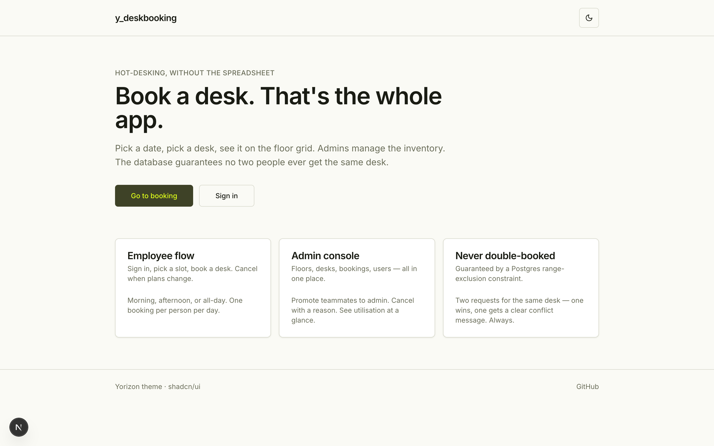
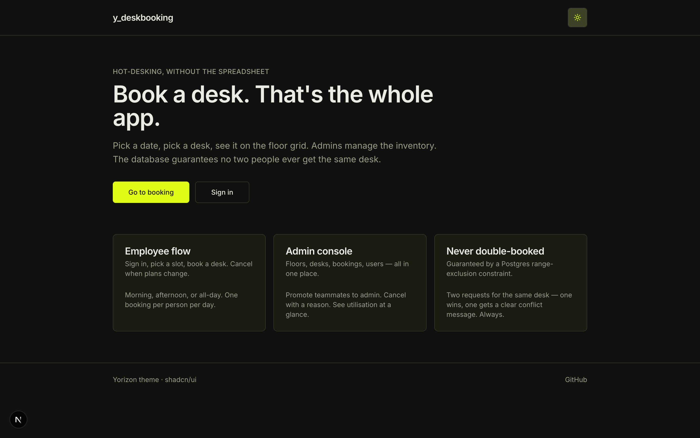
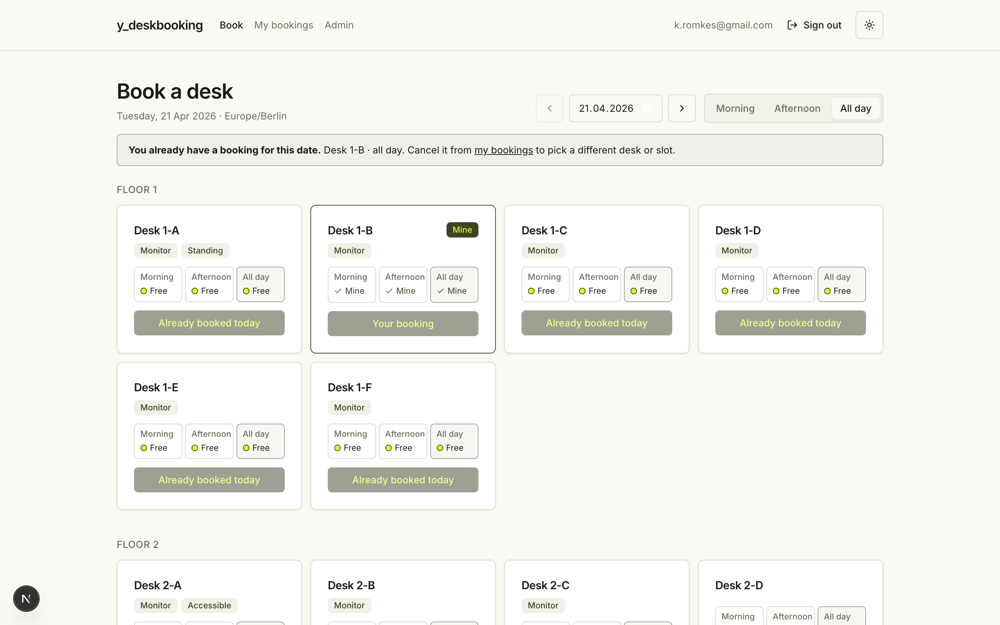
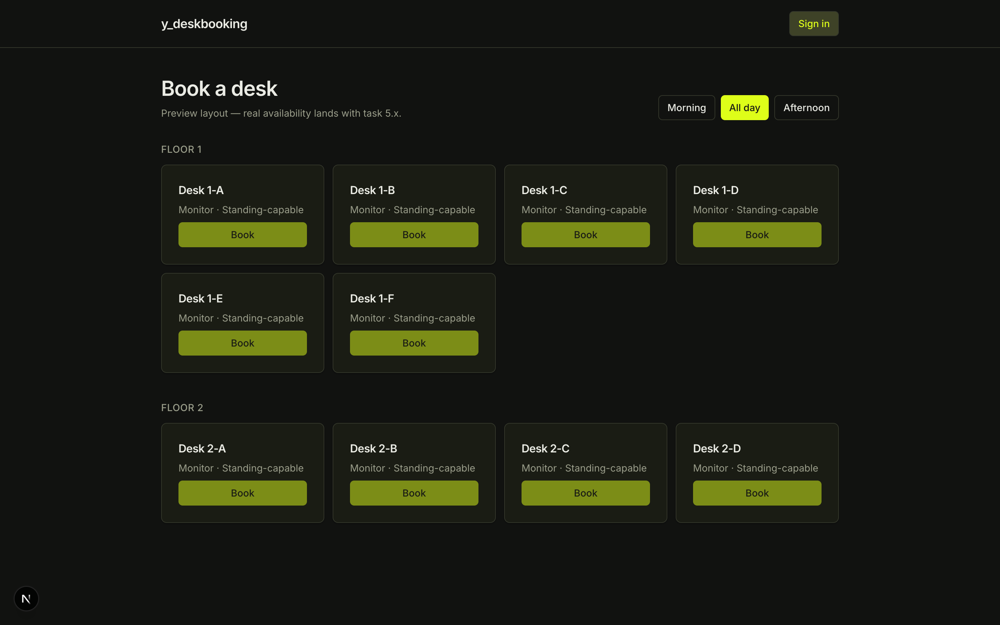
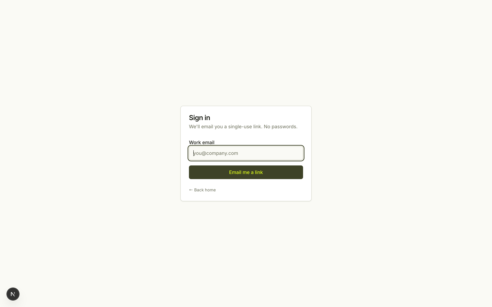

# y_deskbooking

> A spec-first demo of a minimal desk-booking tool for hot-desking / flex-office teams.

This repository contains a full OpenSpec package (proposal, design, specs, tasks) **and** the Next.js app scaffold implementing it. The app boots, builds clean, and renders the Yorizon theme. Auth, DB, and real booking logic land in the next task groups.

## Preview

| | Light | Dark |
|---|---|---|
| **Home** |  |  |
| **Booking grid** |  |  |
| **Sign-in** |  | — |

---

## What it is

A small web app where an employee can:

1. Sign in with a magic link.
2. Pick a date and a time slot (`morning` / `afternoon` / `all-day`).
3. See a grid of desks grouped by floor, with a clear indicator of which ones are free.
4. Book a free desk — and only a free desk, even under concurrent requests.
5. View and cancel their own upcoming bookings.

An admin can additionally:

- Manage floors and desks (labels, attributes, active/inactive).
- Oversee every booking, cancel with an audit reason, and see utilisation.
- Promote / demote other users between `user` and `admin`.

## Architecture at a glance

Kept deliberately boring so that one person can ship, deploy, and maintain it.

| Layer                | Choice                                                                 |
| -------------------- | ---------------------------------------------------------------------- |
| **Framework**        | Next.js (App Router) + TypeScript                                      |
| **UI**               | shadcn/ui + Tailwind CSS v4, themed with **Yorizon**                   |
| **Auth**             | Auth.js (NextAuth v5), email magic-link via Resend                     |
| **DB / ORM**         | Postgres (Neon) + Prisma                                               |
| **Concurrency**      | DB-level `EXCLUDE USING GIST` constraint — overlaps are impossible     |
| **Hosting**          | Vercel                                                                 |

One repo, one service, one DB. No queues, no workers, no microservices.

## The Yorizon theme

The visual identity is applied through shadcn/ui design tokens exported from the [tweakcn](https://ytweakcn.vercel.app/editor/theme?theme=yorizon) editor. Dark olive (`#3e4227`) and electric lime (`#defe19`) swap roles between light and dark modes — the lime is the primary CTA colour in dark mode and the accent in light mode.

<!-- These swatches are SVGs generated from the exact token values captured in design.md -->

**Light mode**


**Dark mode**


The full token block — `:root` + `.dark` — is embedded in [`openspec/changes/desk-booking-tool/design.md`](./openspec/changes/desk-booking-tool/design.md#4-ui-shadcnui--tailwind-v4-themed-with-yorizon) and is intended to drop verbatim into `app/globals.css`.

## Where to start reading

The spec package is ordered so that each file builds on the previous:

| File                                                                                       | Purpose                                                         |
| ------------------------------------------------------------------------------------------ | --------------------------------------------------------------- |
| [`openspec/changes/desk-booking-tool/proposal.md`](./openspec/changes/desk-booking-tool/proposal.md) | Why this exists, what capabilities it introduces                |
| [`openspec/changes/desk-booking-tool/design.md`](./openspec/changes/desk-booking-tool/design.md)     | Technical decisions, stack rationale, full Yorizon token block  |
| [`openspec/changes/desk-booking-tool/specs/`](./openspec/changes/desk-booking-tool/specs)           | Per-capability requirements + WHEN/THEN scenarios                |
| [`openspec/changes/desk-booking-tool/tasks.md`](./openspec/changes/desk-booking-tool/tasks.md)       | Implementation checklist, in dependency order                    |

### Capabilities

- [`user-auth`](./openspec/changes/desk-booking-tool/specs/user-auth/spec.md) — magic-link sign-in, session lifecycle, role-based route protection
- [`desk-inventory`](./openspec/changes/desk-booking-tool/specs/desk-inventory/spec.md) — floors, desks, attributes, activation
- [`desk-booking`](./openspec/changes/desk-booking-tool/specs/desk-booking/spec.md) — availability, booking, one-per-day rule, cancel
- [`admin-console`](./openspec/changes/desk-booking-tool/specs/admin-console/spec.md) — admin views for all of the above plus user roles

## Running locally (once implemented)

The tasks file drives the build; below is the intended dev setup after task group 1–2 are complete:

```bash
# install
npm install

# env (copy + fill)
cp .env.example .env.local

# database
npx prisma migrate dev
npm run db:seed          # creates a first admin + sample desks

# dev server
npm run dev              # → http://localhost:3000
```

Required env vars (see `.env.example`, to be added by task 1.2 / 2.1):

| Var                 | What for                                     |
| ------------------- | -------------------------------------------- |
| `DATABASE_URL`      | Pooled Postgres connection string (Neon)     |
| `DIRECT_URL`        | Direct connection for Prisma migrations      |
| `AUTH_SECRET`       | NextAuth JWT signing key                     |
| `AUTH_RESEND_KEY`   | Resend API key for magic-link emails         |
| `AUTH_URL`          | Base URL (`http://localhost:3000` in dev)    |
| `SEED_ADMIN_EMAIL`  | Email address seeded as the first admin      |
| `OFFICE_TZ`         | IANA timezone, e.g. `Europe/Berlin`          |

## Deploying

- **Target:** Vercel, linked to this repo.
- **Preview deploys:** every PR gets its own URL.
- **Migrations:** `prisma migrate deploy` runs at deploy time.
- **Rollback:** Vercel's previous-deployment rollback is one click. Schema changes are shipped additive-first so a rollback never requires a schema revert.

Full deploy steps are task group 8 in `tasks.md`.

## Status

- [x] Proposal
- [x] Design (stack + full Yorizon token block)
- [x] Specs (4 capabilities, scenario-backed)
- [x] Task list (9 groups, ~50 tasks)
- [x] **Task group 1 — Project bootstrap** (Next.js 15, Tailwind v4, shadcn/ui new-york, Yorizon tokens live, theme toggle, Inter font)
- [x] **Task group 2 — DB schema** (Prisma 6 schema + EXCLUDE constraint live on Neon, overlap-rejection smoke-tested, seed script run)
- [ ] Task group 3 — Auth.js wiring
- [ ] Task groups 4–6 — Admin, booking flow, oversight
- [ ] Task groups 7–9 — Polish, deploy, screenshots-of-real-flow
- [ ] First production deploy

## Licence

MIT — see [`LICENSE`](./LICENSE).
