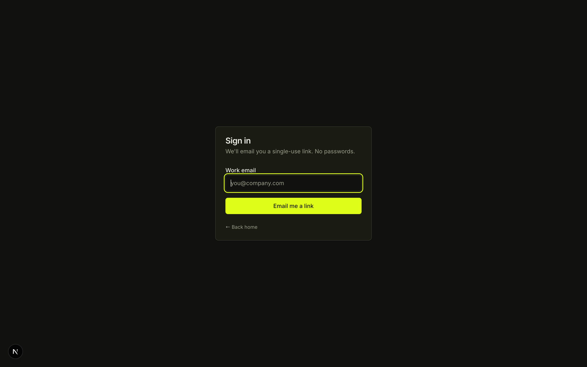
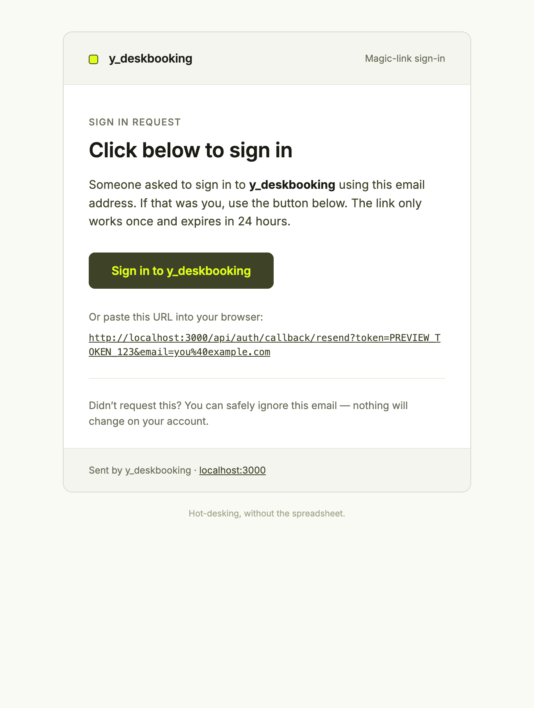
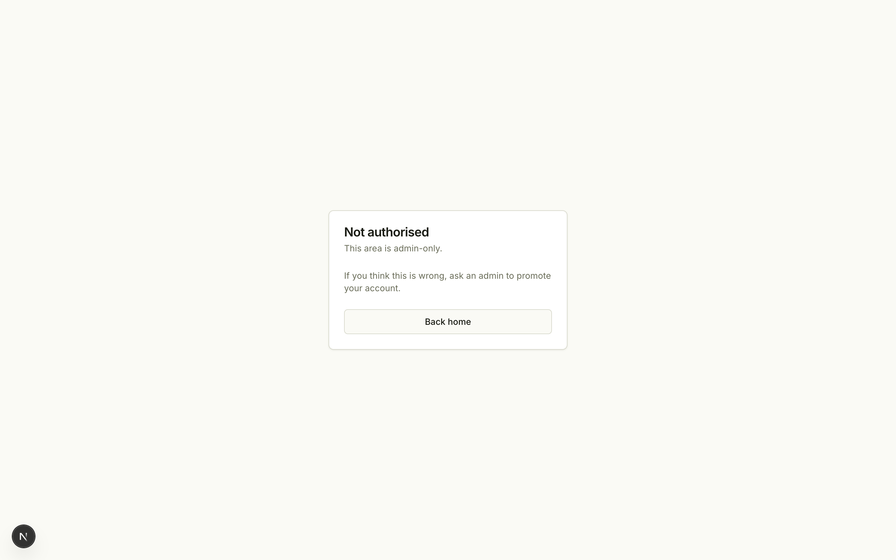

# y_deskbooking

> A minimal, opinionated desk-booking tool for hot-desking offices.
> Spec-first (OpenSpec), implemented in Next.js, and shipped with a DB-level
> guarantee that two people can never book the same desk for overlapping time.

**Live: https://y-deskbooking.vercel.app** — deployed on Vercel against a Neon Postgres. The seeded admin user and ten desks across two floors are already there; request a magic link on `/sign-in`.

---

## Preview

| | Light | Dark |
|---|---|---|
| **Home** |  |  |
| **Sign-in** |  |  |
| **Magic-link email** |  | — |
| **Forbidden (non-admin)** |  | — |
| **Yorizon palette** |  |  |

> Authenticated screens (`/book`, `/my-bookings`, `/admin/*`) aren't shown here because grabbing them requires a signed-in session. They follow the same Yorizon theme — click the magic link in your inbox and you're in.

---

## What works today

All four capabilities from [`proposal.md`](./openspec/changes/desk-booking-tool/proposal.md) are implemented end-to-end locally.

| Capability | Status | Highlights |
|---|---|---|
| `user-auth` | ✅ | Email magic-link (Resend via `cdit-works.de`), auto-provisioning, 30-day JWT session, role-based route protection, custom Yorizon-branded email |
| `desk-inventory` | ✅ | Floors + desks CRUD in `/admin/floors`, drag-to-reorder (`@dnd-kit`), inline rename, empty-floor delete guard, active toggle |
| `desk-booking` | ✅ | `/book` grid with date nav + slot tabs + per-slot state (free/mine/taken), `/my-bookings` with cancel, 60-day window, one-per-day rule, **DB-level overlap prevention** |
| `admin-console` | ◐ partial | Admin layout + minimal dashboard + floors/desks manager done. Booking oversight, admin-cancel-with-reason, and user role toggle are task group 6 (next up). |

### Invariants the DB enforces, not just app code

- **No two confirmed bookings can overlap on the same desk.** Enforced by a Postgres `EXCLUDE USING GIST` constraint on a trigger-populated `tstzrange` column. [See the migration](./prisma/migrations/20260421104157_booking_no_overlap/migration.sql).
- Verified with repeatable smoke tests: [`prisma/smoke-overlap.ts`](./prisma/smoke-overlap.ts) and [`prisma/smoke-booking.ts`](./prisma/smoke-booking.ts). Both run green against Neon.

---

## Architecture at a glance

Kept deliberately boring — one person can ship, deploy, and maintain it.

| Layer | Choice |
|---|---|
| Framework | Next.js 15 (App Router) + TypeScript |
| UI | shadcn/ui (new-york) + Tailwind CSS v4, themed with **Yorizon** |
| Auth | Auth.js v5 (next-auth beta) + Prisma adapter, magic-link via Resend |
| Database | Postgres (Neon, EU) + Prisma 6 |
| Concurrency | DB-level `EXCLUDE` constraint — overlaps are impossible |
| Hosting | Vercel (not yet deployed) |

One repo, one service, one DB. No queues, no workers, no microservices.

For the long version — stack rationale, the Yorizon token block, the
`tstzrange` IMMUTABLE workaround, and the open design questions — read
[`docs/architecture.md`](./docs/architecture.md).

---

## Reading order (for a new contributor)

1. [`openspec/changes/desk-booking-tool/proposal.md`](./openspec/changes/desk-booking-tool/proposal.md) — **why** this exists and what it introduces
2. [`openspec/changes/desk-booking-tool/design.md`](./openspec/changes/desk-booking-tool/design.md) — **how** it's built, with the Yorizon token block
3. [`openspec/changes/desk-booking-tool/specs/`](./openspec/changes/desk-booking-tool/specs) — per-capability requirements with WHEN/THEN scenarios
4. [`openspec/changes/desk-booking-tool/tasks.md`](./openspec/changes/desk-booking-tool/tasks.md) — the implementation checklist (live progress)

### Capability specs

- [`user-auth`](./openspec/changes/desk-booking-tool/specs/user-auth/spec.md)
- [`desk-inventory`](./openspec/changes/desk-booking-tool/specs/desk-inventory/spec.md)
- [`desk-booking`](./openspec/changes/desk-booking-tool/specs/desk-booking/spec.md)
- [`admin-console`](./openspec/changes/desk-booking-tool/specs/admin-console/spec.md)

---

## Local development

### Prerequisites

- Node 20 LTS or newer
- A Postgres database with the `btree_gist` extension available (Neon works out of the box; a local Postgres 14+ does too)
- A Resend account + verified sending domain (or swap the provider in `auth.ts`)

### First run

```bash
# 1. Install
npm install

# 2. Configure env
cp .env.example .env.local
# edit .env.local — DATABASE_URL, DIRECT_URL, AUTH_SECRET, AUTH_RESEND_KEY, SEED_ADMIN_EMAIL

# 3. Apply schema + constraints
npx prisma migrate deploy      # runs both migrations in order

# 4. Seed (one admin + two floors + ten desks)
npm run db:seed

# 5. Run
npm run dev                    # http://localhost:3000
```

### Handy scripts

| Command | What it does |
|---|---|
| `npm run dev` | Next dev server with Turbopack |
| `npm run build` | Production build |
| `npm run lint` | Next/ESLint |
| `npm run typecheck` | `tsc --noEmit` |
| `npm run db:seed` | Seed admin + floors + desks |
| `npx tsx prisma/smoke-overlap.ts` | Proves DB rejects overlapping bookings |
| `npx tsx prisma/smoke-booking.ts` | Proves slot math, overlap, all-day-over-morning, free-after-cancel |
| `npx tsx scripts/preview-email.ts` | Renders `docs/screenshots/magic-link-email.html` for local preview |

### Environment variables

| Var | Purpose |
|---|---|
| `DATABASE_URL` | Pooled Postgres connection (app reads/writes) |
| `DIRECT_URL` | Direct connection (used only by Prisma migrate) |
| `AUTH_SECRET` | NextAuth JWT signing key (`openssl rand -base64 32`) |
| `AUTH_URL` | Public app URL (`http://localhost:3000` in dev) |
| `AUTH_RESEND_KEY` | Resend API key |
| `AUTH_EMAIL_FROM` | Magic-link sender address (must match a verified Resend domain) |
| `SEED_ADMIN_EMAIL` | Email that gets role=admin on first seed |
| `OFFICE_TZ` | IANA timezone for booking slots (default `Europe/Berlin`) |

---

## Deploy

Not live yet. The stack targets Vercel + Neon and the path is documented in [`docs/deploy.md`](./docs/deploy.md). Short version: create the Vercel project linked to this repo, paste the env vars, run `prisma migrate deploy` on build, promote to production. Nothing clever.

---

## Status & roadmap

- [x] Proposal, design, specs, tasks (OpenSpec package)
- [x] Task group 1 — **Project bootstrap** (Next.js 15, Tailwind v4, shadcn/ui, Yorizon tokens)
- [x] Task group 2 — **DB schema on Neon** (EXCLUDE overlap live, smoke-tested)
- [x] Task group 3 — **Auth.js magic-link** (Resend via `cdit-works.de`, role-gated middleware, Yorizon-branded email)
- [x] Task group 4 — **Admin inventory UI** (floors + desks with drag, dialogs, toasts)
- [x] Task group 5 — **Booking flow** (`/book` grid, `/my-bookings`, cancel)
- [ ] Task group 6 — Admin booking oversight + user role toggle
- [ ] Task group 7 — A11y + polish + responsive
- [x] Task group 8 — **First production deploy on Vercel** (live at https://y-deskbooking.vercel.app, both Prisma migrations applied via `vercel-build`)
- [ ] Task group 9 — Expand docs with real authed-flow screenshots

Live progress in [`openspec/changes/desk-booking-tool/tasks.md`](./openspec/changes/desk-booking-tool/tasks.md).

## Licence

MIT — see [`LICENSE`](./LICENSE).
